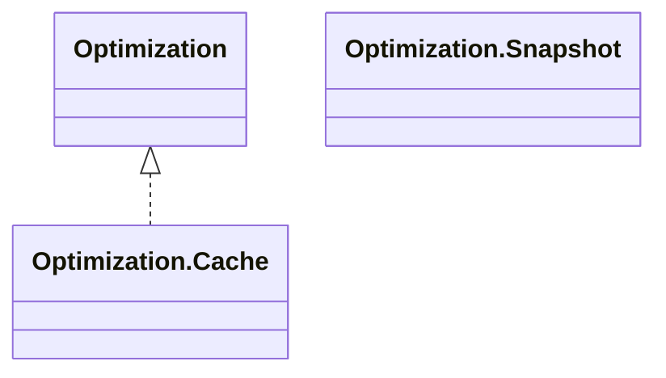

# Iterflow

[](https://www.npmjs.com/package/@zimtsui/iterflow)

Iterflow is an AI workflow orchestrator specifically designed for Optimizer-Evaluator design patterns.

## Examples

### Optimizer

```ts
import { Opposition, Optimization, Rejection } from '@zimtsui/iterflow';
import OpenAI from 'openai';
declare const openai: OpenAI;

export async function *optimize(problem: string): Optimization<string> {
    const messages: OpenAI.ChatCompletionMessageParam[] = [
        {
            role: 'system',
            content: [
                'Please solve math problems.',
                'Your answer will be evaluated and the feedback will be provided if the answer is rejected.'
            ].join(' ')
        },
        { role: 'user', content: problem },
    ];
    for (;;) try {
        const completion = await openai.chat.completions.create({ model: 'gpt-4o', messages });
        messages.push(completion.choices[0]!.message);
        if (completion.choices[0]!.message.content! === 'OPPOSE')
            return yield Promise.reject(new Opposition('My answer is correct.'));
        else
            return yield completion.choices[0]!.message.content!;
    } catch (e) {
        if (e instanceof Rejection) {} else throw e;
        messages.push({
            role: 'user',
            content: `Your answer is rejected: ${e.message}. Please revise your answer.`,
        });
    }
}
```

### Evaluator

```ts
import { Evaluation, Rejection, Opposition } from '@zimtsui/iterflow';
import OpenAI from 'openai';
declare const openai: OpenAI;

export async function *evaluate(problem: string): Evaluation<string> {
    let draft = yield Promise.reject(new Evaluation.FirstYield());
    const messages: OpenAI.ChatCompletionMessageParam[] = [
        {
            role: 'system',
            content: [
                'Please examine the given answer of the given math problem.',
                'Print only `ACCEPT` if it is correct.',
            ].join(' '),
        },
        { role: 'user', content: `Problem: ${problem}\n\nAnswer: ${draft}` },
    ];
    for (;;) try {
        const completion = await openai.chat.completions.create({ model: 'gpt-4o', messages });
        messages.push(completion.choices[0]!.message);
        if (completion.choices[0]!.message.content === 'ACCEPT') {}
        else throw new Rejection(completion.choices[0]!.message.content!);
        draft = yield draft;
        messages.push({
            role: 'user',
            content: `The answer is revised: ${draft}\n\nPlease examine it again.`,
        });
    } catch (e) {
        if (e instanceof Rejection) {} else throw e;
        try {
            const draft = await Promise.reject(e);
            messages.push({
                role: 'user',
                content: `The answer is revised: ${draft}\n\nPlease examine it again.`,
            });
        } catch (e) {
            if (e instanceof Opposition) {} else throw e;
            messages.push({
                role: 'user',
                content: `Your rejection is opposed: ${e.message}\n\nPlease examine it again.`,
            });
        }
    }
}
```

### Workflow

```ts
import { Optimization, Evaluation, opteva, Rejection } from '@zimtsui/iterflow';
import { optimize } from './optimize.ts';
import { evaluate } from './evaluate.ts';
const evaluate1: (problem: string) => Evaluation<string, string> = evaluate;
declare const evaluate2: (problem: string) => Evaluation<string, number>;
declare const evaluate3: (problem: string) => Evaluation<number, number>;

export async function workflow(problem: string): Promise<number> {
    await using optimization = Optimization.Cache.from(optimize(problem));
    await using snapshot0 = Optimization.Snapshot.from(optimization);
    await using evaluation1 = await Evaluation.Initialized.from(evaluate1(problem));
    await using evaluation2 = await Evaluation.Initialized.from(evaluate2(problem));
    await using evaluation3 = await Evaluation.Initialized.from(evaluate3(problem));
    for (;;) try {
        await using snapshot1 = await opteva(snapshot0, evaluation1);
        await using snapshot2 = await opteva(snapshot1, evaluation2);
        await using snapshot3 = await opteva(snapshot2, evaluation3);
        return await snapshot3.next().then(r => r.value);
    } catch (e) {
        if (e instanceof Rejection) {} else throw e;
    }
};
```

## Subtypes


